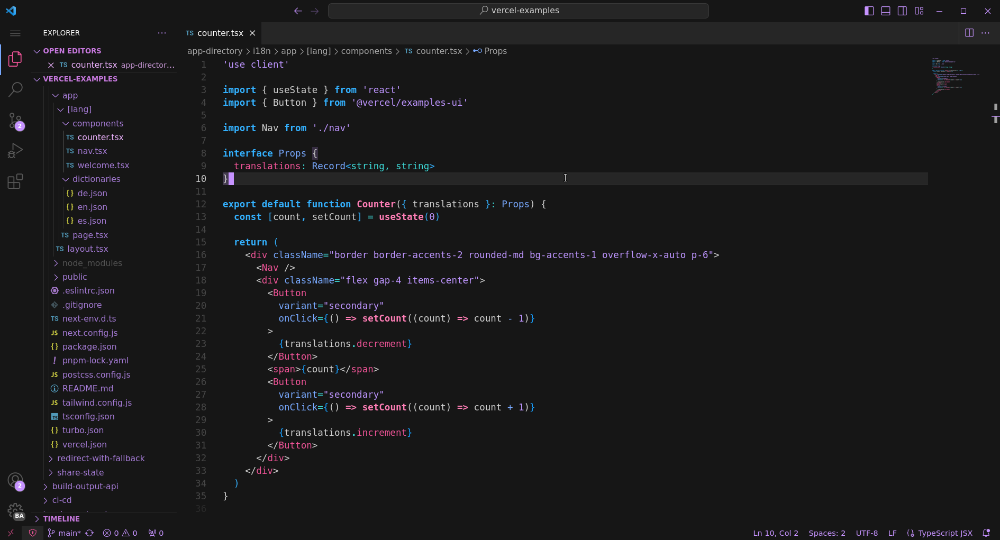

# Alice Carbon Theme

### [Nyoom Oxocarbon Theme](https://github.com/nyoom-engineering/oxocarbon.nvim) port for Visual Studio Code

- Semantic tokens generated based on the [Eva Theme](https://github.com/fisheva/Eva-Theme/)
- [oxocarbon-port](https://marketplace.visualstudio.com/items?itemName=beamlnwza.oxocarbon-port) was used as a base for the editor colors.

---

